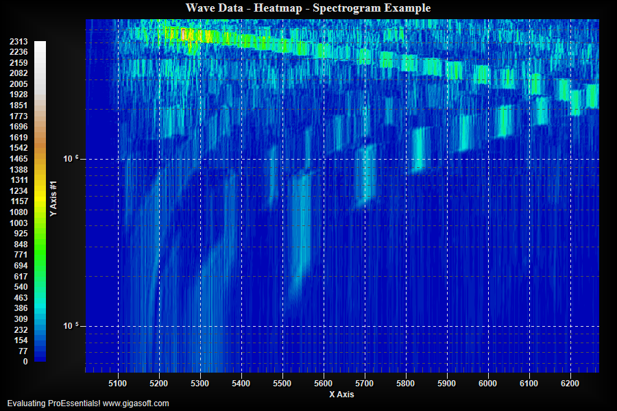

# ProEssentials WPF Realtime Heatmap — Spectrogram — 2D Contour

A ProEssentials v10 WPF .NET 8 demonstration of a realtime heatmap /
spectrogram / 2D contour chart that replaces the entire 93,696-value
surface every 25ms using a tiled data pool with per-row horizontal
shifting — the full frequency landscape scrolls left/right like a live
spectrum analyzer without any vertical drift.

> **Looking for the simpler non-realtime version?**
> See [wpf-heatmap-spectrogram-wave-data-proessentials](https://github.com/GigasoftInc/wpf-heatmap-spectrogram-wave-data-proessentials) —
> same chart configuration, no timer, ideal as a starting point.



---

## What Makes This Different

Most realtime chart examples scroll data in one direction like a strip
chart. This example replaces the **entire heatmap surface simultaneously**
each tick — every frequency band shifts horizontally in unison, like a
live spectrum analyzer or SDR waterfall display.

---

## Architecture

```
fZDataPool[281,088]  ← Heatmap.txt Z values tiled 3× in memory
                        3 × 93,696 = 281,088 floats (~1.1 MB)

fZDataToChart[93,696]← Fixed buffer — UseDataAtLocation points here permanently.
                        Per-row Array.Copy writes shifted data each tick.
                        Chart reads from the same fixed address every frame.
                        At ~366KB, safely above the 85KB GC pinning threshold.

fXDataPool[512]      ← X axis values — FastCopyFrom at init (512 floats = 2KB,
                        under 85KB threshold, unsafe for UseDataAtLocation)
fYDataPool[183]      ← Y axis values — FastCopyFrom at init (183 floats = ~720B,
                        under 85KB threshold, unsafe for UseDataAtLocation)
```

> **85KB pinning rule:** Arrays under ~85KB can be relocated by the .NET GC.
> `UseDataAtLocation` stores a raw pointer — if the GC moves a small array,
> the pointer becomes invalid and the chart reads garbage data or crashes.
> Arrays above 85KB go on the Large Object Heap and are never relocated.
> Always use `FastCopyFrom` for small arrays, `UseDataAtLocation` only for
> large ones.

**Init:**
```csharp
// X and Y: FastCopyFrom — safely copies small arrays into ProEssentials' own buffer
Pesgo1.PeData.X.FastCopyFrom(fXDataPool, POINTS);
Pesgo1.PeData.Y.FastCopyFrom(fYDataPool, SUBSETS);

// Z: UseDataAtLocation — ~366KB, safe on Large Object Heap, pointer never relocates
Pesgo1.PeData.Z.UseDataAtLocation(fZDataToChart, FRAME_SIZE);
```

**Each tick — per-row horizontal shift with wrap:**
```csharp
m_nZOffset += Rand_Num.Next(50, 200);
if (m_nZOffset >= POINTS) { m_nZOffset = 0; }

int rightLen = POINTS - m_nZOffset;
for (int s = 0; s < SUBSETS; s++)
{
    int srcRow = s * POINTS;
    int dstRow = s * POINTS;
    // Right portion — from colOffset to end of row
    Array.Copy(fZDataPool, srcRow + m_nZOffset, fZDataToChart, dstRow,            rightLen);
    // Left portion — wrap from start of row
    Array.Copy(fZDataPool, srcRow,              fZDataToChart, dstRow + rightLen, m_nZOffset);
}

Pesgo1.PeData.ReuseDataX = true;  // prevent unnecessary CPU→GPU X transfer
Pesgo1.PeData.ReuseDataY = true;  // prevent unnecessary CPU→GPU Y transfer
Pesgo1.PeFunction.Force3dxNewColors      = true;
Pesgo1.PeFunction.Force3dxVerticeRebuild = true;
Pesgo1.Invalidate();
```

Each row stays in its correct Y frequency band — only the X position
within each row advances, giving pure horizontal movement.

---

## Step Size Tuning

```csharp
m_nZOffset += Rand_Num.Next(50, 200);  // ← tune this
```

| Step Range | Effect |
|------------|--------|
| `Next(1, 10)` | Slow, smooth horizontal drift |
| `Next(50, 200)` | Natural organic movement ← default |
| `Next(500, 2000)` | Dramatic rapid shifting |

---

## ProEssentials Features Demonstrated

**`UseDataAtLocation(array, count)`** — passes a direct pointer to a
large fixed buffer. The chart reads from that address every frame without
any internal copy. Only safe for arrays ≥ 85KB (Large Object Heap).

**`FastCopyFrom(array, count)`** — copies small arrays into ProEssentials'
own internal buffer. Safe for any size — required for X and Y arrays
that are under the 85KB GC relocation threshold.

**`ReuseDataX` / `ReuseDataY`** — signals that X and Y are unchanged
since the last tick. Prevents ProEssentials from re-transferring these
arrays CPU→GPU every frame — important for performance even when not
using staging buffers.

**`ComputeShader`** — GPU handles contour color interpolation for all
93,696 Z values every tick. No staging buffers needed for 2D contour —
only the 3D line/scatter path requires them.

**`DuplicateDataX` / `DuplicateDataY`** — only 512 X values and 183
Y values stored; chart duplicates them across all subsets/points.

**`Composite2D3D.Foreground`** — Direct3D renders the contour fill,
2D axis/grid/labels composited on top in the foreground.

**`ContourColors`** — interpolated color fill between contour lines.
Blue (low Z) → Cyan → Green → Yellow → Brown → White (high Z).

**Log Y axis** — equal visual space per octave, standard for frequency data.

**Cursor prompt disabled in realtime mode** — `PromptTracking` triggers
hit testing on every mouse move event which stalls the timer loop in
realtime mode. Commented out with a note — re-enable for static use.

---

## Data File

`Heatmap.txt` — 93,696 lines, tab-delimited X/Y/Z.
183 rows × 512 columns. Copied to output directory on build.

---

## Prerequisites

- Visual Studio 2022
- .NET 8 SDK
- Dedicated GPU recommended
- Internet connection for NuGet restore

---

## How to Run

```
1. Clone this repository
2. Open RealtimeHeatmap.sln in Visual Studio 2022
3. Build → Rebuild Solution (NuGet restore is automatic)
4. Press F5
```

---

## NuGet Package

References
[`ProEssentials.Chart.Net80.x64.Wpf`](https://www.nuget.org/packages/ProEssentials.Chart.Net80.x64.Wpf).
Restore is automatic on build.

---

## Related Examples

- [Heatmap Spectrogram — Static (simpler starting point)](https://github.com/GigasoftInc/wpf-heatmap-spectrogram-wave-data-proessentials)
- [3D Realtime Surface — ComputeShader](https://github.com/GigasoftInc/wpf-3d-surface-realtime-computeshader-proessentials)
- [GigaPrime2D WPF — 100 Million Points](https://github.com/GigasoftInc/wpf-chart-fast-100m-points-proessentials)
- [All Examples — GigasoftInc on GitHub](https://github.com/GigasoftInc)
- [Full Evaluation Download](https://gigasoft.com/net-chart-component-wpf-winforms-download)
- [gigasoft.com](https://gigasoft.com)

---

## License

Example code is MIT licensed. ProEssentials requires a commercial
license for continued use.
